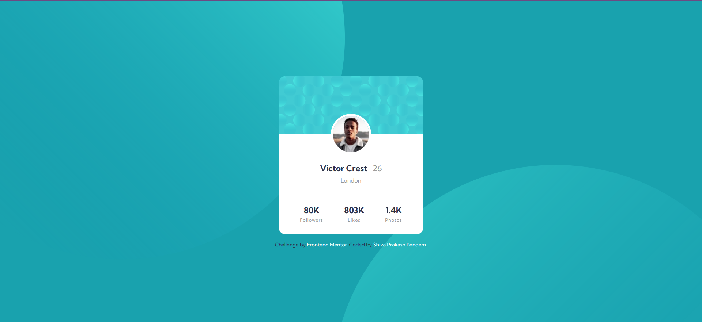

# Frontend Mentor - Profile card component solution

This is a solution to the [Profile card component challenge on Frontend Mentor](https://www.frontendmentor.io/challenges/profile-card-component-cfArpWshJ). Frontend Mentor challenges help you improve your coding skills by building realistic projects.

## Table of contents

- [Overview](#overview)
  - [The challenge](#the-challenge)
  - [Screenshots](#screenshots)
  - [Links](#links)
- [My process](#my-process)
  - [Built with](#built-with)
- [Author](#author)

## Overview

### The challenge

- Build out the project to the designs provided

### Screenshots

##### Desktop View

##### Mobile View

### Links

- Solution URL: [GitHub repo](https://github.com/shivaprakash-sudo/profile-card-component)
- Live Site URL: [Profile Card Component](https://shivaprakash-sudo.github.io/profile-card-component)

## My process

### Built with

- Semantic HTML5 markup
- CSS custom properties
- Flexbox
- Mobile-first workflow

## Author

- Frontend Mentor - [@shivaprakash-sudo](https://www.frontendmentor.io/profile/shivaprakash-sudo)
